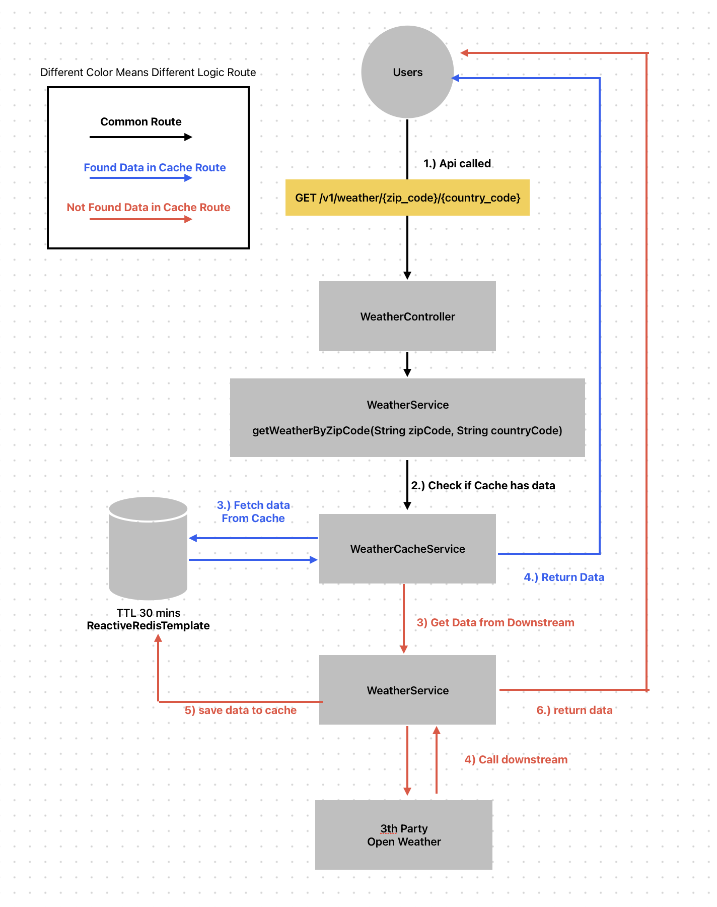

# weatherdemo
_____________________________________________________________________
### Environment Requirement
Java17 or Higher  
Maven 3.8.6 or Higher  
Docker 27.5.1 or Higher ( for running Redis )
_____________________________________________________________________

### Local Deployment Steps
1.) open ```application.properties```, replace ```OPEN_WEATHER_API_KEY``` with ```api key``` from Open Weather. (https://home.openweathermap.org/api_keys) Or please ping me for a working one 😊  

2.) ```mvn clean install```  

3.) run redis: ```docker-compose up -d``` ( stop redis: ```docker-compose down``` )  

4.) run default ```WeatherdemoApplication``` in Intellij or ```mvn clean install```  

5.) quick test ```curl "http://localhost:8080/v1/weather/health/full"```  

6.) expecting ```Health Check Ok```

7.) testing the main api ```/v1/weather/{{zip_code}}/{{country_code}}```:   
- cURL: ```curl "http://localhost:8080/v1/weather/94043/US"```  
- postman collection: ```curl --location 'http://localhost:8080/v1/weather/94043/US'```
_____________________________________________________________________

### Some Helpful Note:
- Login into redis & check keys:  
  1.) ```docker exec -it <CONTAINER_ID> redis-cli```  
  2.) ```keys *```

- stop redis: ```docker-compose down```

- delete all data in redis: ```FLUSHDB```
_____________________________________________________________________

### Logs & Info
- 200 response:
```json
{
  "city": {
    "name": "Mountain View",
    "country": "US"
  },
  "list": [
    {
      "dt": 1741240800,
      "main": {
        "temp": 9.25,
        "pressure": 1013,
        "humidity": 84,
        "feels_like": 8.09,
        "temp_min": 8.66,
        "temp_max": 9.25
      },
      "weather": [
        {
          "description": "light rain",
          "icon": "10n"
        }
      ]
    }
  ]
}
```

- if data NOT found in cache, log will print:
```text
Fetching from API: https://api.openweathermap.org/data/2.5/forecast?zip=94043,US ...
Weather API Response: ...
...
```
and the response will be saved in cache for 30 mins with log point

```text
Weather data cached for zipCode: 94043:US with TTL: 30 minutes
```  

- if data FOUND in cache:
```text
Cache found for cacheKey:
Cache hit for zipCode: 94043, US
```
_____________________________________________________________________
### Logic Diagram

